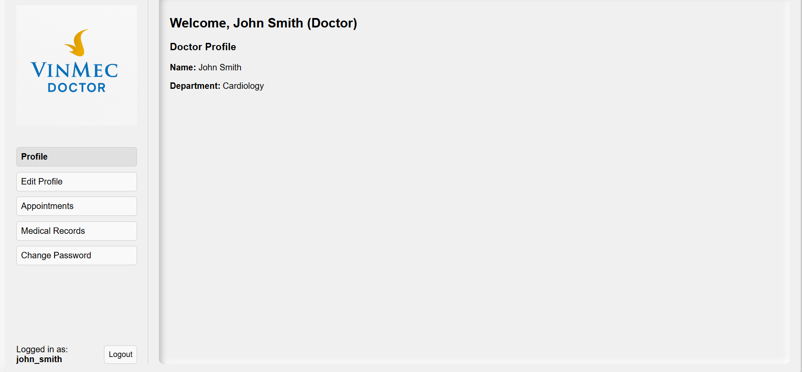

# Hospital Management System Project


## 1. Project Overview

### 1.1. Description

This project presents a comprehensive **Hospital Management System** designed and implemented using **MySQL**, with a modern web interface built using **Flask (Python)** and **Node.js + TypeScript**. The system aims to optimize hospital operations including patient management, doctor scheduling, medical records, billing, and secure user access. 

### 1.2. Key Features

- Role-based login for Admin, Doctor, and Patient
- Full CRUD operations for core entities
- Secure appointment scheduling
- Medical record tracking
- Data analytics & reporting via SQL views
- Encrypted password management
- Responsive frontend dashboard

---

## 2. Functional & Non-functional Requirements

### 2.1. Functional Requirements

- **Entities Management**: Full CRUD for Patients, Doctors, Appointments, Medical Records, Departments, and Services.
- **Appointment Scheduling**: Manage doctor-patient appointments.
- **Medical Records Management**: Record diagnoses, treatments, prescriptions, test results.
- **Reporting & Analytics**: Generate SQL-based statistics and performance metrics.
- **Authentication & Authorization**: Secure role-based access system.
- **Search & Filtering**: Dynamic filters and full search across records.



### 2.2. Non-functional Requirements

- **Security**: Role-based access control, hashed passwords, parameterized queries.
- **Performance**: Optimized queries, indexing, caching with Flask-Caching.
- **Usability**: Intuitive UI, role-based dashboards.
- **Reliability**: Strong schema design with constraints and normalization.


---

## 3. System Schema Overview

### 3.1. Core Entities

- `Patients`: Demographics & contact info.
- `Doctors`: Credentials, specialization, department.
- `Appointments`: Schedules & status.
- `MedicalRecords`: Diagnosis & treatment info.
- `Users`: Login accounts, role-based access.
- `Departments`: Department list.
- `Services`: Medical services & costs.
- `UserProfiles`: Extended user details.

### 3.2. Views Created

- **DoctorAppointments**: Number of appointments per doctor.
- **PatientMedicalHistory**: History of diagnoses and treatments for each patient.

```sql
CREATE VIEW DoctorAppointments AS
SELECT d.Name AS DoctorName, COUNT(a.AppointmentID) AS TotalAppointments
FROM Doctor d
JOIN Appointment a ON d.DoctorID = a.DoctorID
GROUP BY d.DoctorID;

CREATE VIEW PatientMedicalHistory AS
SELECT p.Name AS PatientName, a.DateTime, m.Diagnosis, m.Treatment
FROM Patient p
JOIN Appointment a ON p.PatientID = a.PatientID
JOIN MedicalRecord m ON a.AppointmentID = m.AppointmentID;

## 4. Performance Optimizations

- **Indexes**: Added on `patient_id`, `doctor_id`, and `appointment_date`.
- **Caching**: Used `Flask-Caching` to speed up high-traffic endpoints.
- **Role-specific API Logic**: Reduces branching and simplifies endpoint design.

## 5. Security Configuration

- **Role-based Privileges**:
  - **Doctor**: Access to their own appointments and medical records.
  - **Patient**: Access to their own data and appointments.
  - **Admin**: Full system access, user creation, and data visibility.

- **Parameterized Queries**:
  ```python
  sql = "SELECT COUNT(*) FROM User WHERE Username = %s"
  cursor.execute(sql, (username,))

## 6. System Architecture

### 6.1. Tech Stack

- **Database**: MySQL
- **Backend**: Python (Flask)
- **Frontend**: Node.js + TypeScript (React)
- **Connector**: mysql-connector-python
- **Caching**: Flask-Caching

### 6.2. Main Structure

- **Three-layer architecture**:
  - **Database Layer**: Raw SQL scripts for schema creation and test data.
  - **Backend (`/be`)**:
    - `server.py`: Main API entrypoint
    - `db/connection.py`: MySQL connector configuration
    - `models/`: Business logic for each entity
  - **Frontend (`/fe/src`)**:
    - React + TypeScript components
    - Separate pages for Login, Dashboard, Entity Management

## 7. Usage Instructions

### 7.1. Database Setup

1. Open MySQL server
2. Import the SQL files:
   - `Create_Database.sql`
   - `Insert_Database.sql`

### 7.2. Backend Setup

```bash
cd be/
pip install -r requirements.txt
# Configure your MySQL credentials in db/connection.py
python server.py

### 7.3. Frontend Setup
```bash
cd fe/
npm install
npm start

## 8. Testing & Validation
- Over **70 test cases** implemented
- **Highlighted tests** included in the demo video
- For full test suite: see `test_case/` folder in repository or separate Test Case file

## 9. Project Demo

- **Video Demo**: https://www.youtube.com/watch?v=p6534J4aPGg 
- Demonstrates full flow for Admin, Doctor, and Patient accounts
- Showcases:
  - Login & role-based dashboard
  - Search & filter
  - CRUD operations

## 10. Team Members

| Name             | ID           | Role               |
|------------------|--------------|--------------------|
| Ha Minh Dung     | V202200791   | Backend Developer  |
| Nguyen Duc Trung | V202200777   | Data Developer     |
| Tran Hung Dat    | V202200889   | Frontend Developer |


## 11. Project Timeline

| Date       | Milestone                                              |
|------------|--------------------------------------------------------|
| May 6      | Initial requirement analysis                           |
| May 13     | ERD draft, schema planning                             |
| May 20     | Finalized ERD, DDL scripts, task assignments           |
| May 27     | Completed implementation, testing, report & demo prep  |

## 12. Key Learnings & Challenges

- Schema design and normalization in real-world healthcare apps
- Integration between Flask backend and React frontend
- Implementing secure authentication and role separation
- Performance tuning with views, indexing, and caching
- Hands-on experience with stored procedures and triggers
- Managing edge cases and user-specific access logic

## 13. Conclusion
This project demonstrates the successful design and development of a full-stack, database-driven **Hospital Management System**. It combines strong backend logic, secure database design, and a responsive frontend to provide an effective solution for real-world hospital workflows.


